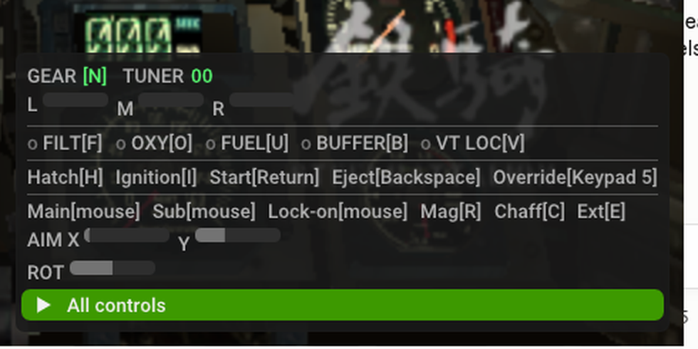
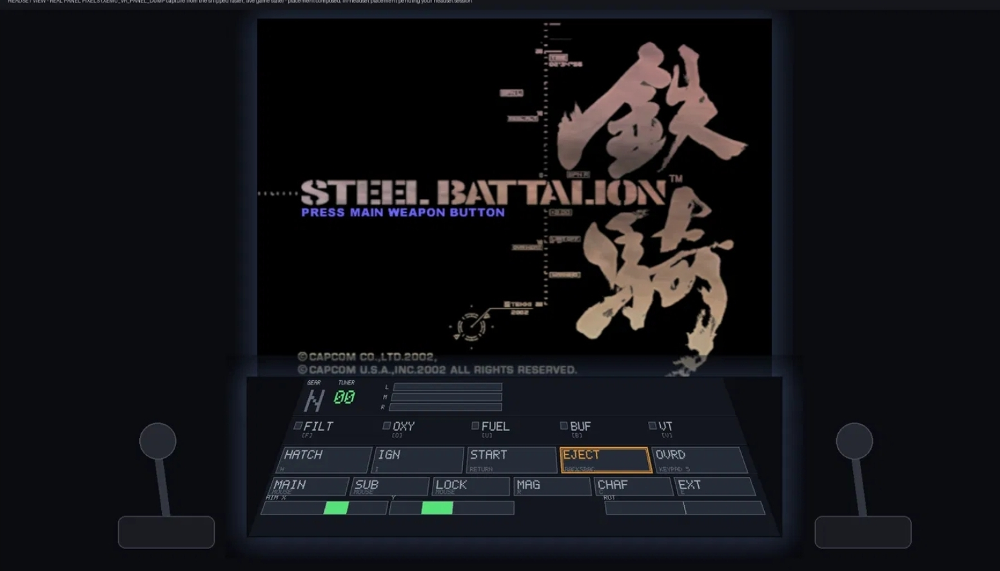

# PenguinBox × Steel Battalion — performance work, launch flags, and the cockpit

A community-facing summary of the Steel Battalion performance campaign on the
PenguinBox xemu fork: what we fixed, every command-line switch you can throw at
it, the upstream PRs we build on, and where the emulated Steel Battalion
Controller lives.

## TL;DR

- **Steel Battalion went from a crash-fixed ~20 FPS to a solid 30** (verified live). Normal gameplay now holds 30 with the render thread using only ~half its frame budget; only the worst-case near-death explosion frame dips to ~23.
- We then **rebuilt how the emulator talks to the GPU** — killing the "record the frame → sit and wait for the GPU → flip" stall (the *present wall*). Emulated-GPU work per frame dropped **~28 ms → ~18 ms**.
- **Why 60 isn't just a flag:** we reverse-engineered the game's frame limiter and found Steel Battalion is a **fixed 30 Hz engine** — it runs exactly one logic step per displayed frame, so simply uncapping it would run the whole game at 2× speed. Real 60 means frame-generation, which is future work. Meanwhile the perf work keeps busy combat locked at 30 (instead of dropping below it) and banks headroom for VR and other games.

---

## Launch flags — every env var, and what it does

All of these are **environment variables** you set before launching the binary,
e.g.:

```
XEMU_TLB_FASTPATH=1 XEMU_FRAME_OVERLAP=1 XEMU_ASYNC_PRESENT=1 \
XEMU_ASYNC_REPORTS=1 XEMU_INBATCH_UPLOADS=1 XEMU_BATCH_QRESET=1 \
XEMU_PIPE_OPT=1 XEMU_ELEMENT_BATCH=1 \
  ./qemu-system-i386 -config_path your.toml -dvd_path "Steel Battalion.iso"
```

Every feature also has an `XEMU_NO_<NAME>=1` form that **force-disables** it (wins over the enable), and each prints a one-line `name: … ON/OFF` to stderr at startup so you can confirm what's active.

### Already on by default (the shipped 20→30 work — no flag needed)
| effect                         | notes |
| ------------------------------ | --- |
| **Read fast-path**             | The big one. Stopped the emulator trapping ~23,000 surface reads/frame down to 1–2. This is what took the radar-live game from 20→30. Always on. |
| **possibly_dirty hashing fix** | Halved per-frame texture hashing. On by default; `XEMU_NO_TEX_DIRTY_CLEAR=1` reverts to the old behavior. |

### Recommended / shipping perf
| flag                  | what it does |
| --------------------- | --- |
| `XEMU_TLB_FASTPATH=1` | TLB read fast-path — the second half of the 20→30 win. Recommended on. |

### The CPU/GPU overlap stack (experimental, opt-in, default OFF)
These remove the serial "present wall." **Opt-in (default off) — set the flags to turn them on; best enabled together.**
| flag                     | what it does |
| ------------------------ | --- |
| `XEMU_FRAME_OVERLAP=1`   | Foundation: per-slot resource recycling so two frames can be in flight. |
| `XEMU_ASYNC_PRESENT=1`   | Submit the frame and keep going instead of blocking on the GPU at flip (the ~6.6 ms present wall). Live-toggle: `touch /tmp/asyncpresent-on`. |
| `XEMU_ASYNC_REPORTS=1`   | Deliver occlusion-query results without stalling the emulator thread — same values, just not blocking. |
| `XEMU_INBATCH_UPLOADS=1` | Record texture/surface uploads inside the frame instead of a blocking side-submit (removes a hidden pipeline-wide drain). |
| `XEMU_BATCH_QRESET=1`    | Batch the query-pool reset once per frame + keep queries inside the render pass → renderpasses/frame **~205 → ~33** (directly attacks the combat slowdown). |

### Smaller levers (opt-in)
| flag                   | what it does |
| ---------------------- | --- |
| `XEMU_PIPE_OPT=1`      | Skip redundant pipeline lookups on texture-only-dirty draws (~0.8 ms). |
| `XEMU_ELEMENT_BATCH=1` | Batch-consume `ARRAY_ELEMENT16/32` streams — SB's actual geometry hot path (~1,160/frame). |
| `XEMU_CONST_SKIP=1`    | Skip per-draw uniform recompute when nothing changed (near-inert on SB — ~82% of draws genuinely change). |

### Do NOT use (kept in the tree, off for a reason)
| flag                   | why not |
| ---------------------- | --- |
| `XEMU_QUERY_RING=1`    | **REFUTED — breaks SB.** Serves stale (previous-frame) occlusion results; SB uses those to decide what to draw, so walls flicker see-through. Documented, kept OFF. |
| `XEMU_ASYNC_QUERIES=1` | Superseded by `ASYNC_REPORTS` (which is strictly better). |
| `XEMU_NARROW_FENCE=1`  | Measured performance-negative twice. |
| `XEMU_EXACT_DIRTY=1`   | Caused mission flicker (co-page false negative). |
| `XEMU_INLINE_BATCH=1`  | Inert on SB (SB feeds geometry via ARRAY_ELEMENT, not INLINE_ARRAY — use `ELEMENT_BATCH`). |

### Instrumentation (for measuring, not for playing)
| flag                   | what it does |
| ---------------------- | --- |
| `XEMU_PHASE_TIMERS=1`  | Prints `phase:` / `pfifo:` / `pfifo2:` frame-time decomposition to stderr (`mspf`, per-bucket ms). |
| `XEMU_GUEST_PROFILE=N` | Statistical profiler of the *guest* CPU (samples 1 per N translation blocks). `XEMU_GUEST_PROFILE_PATH=…` sets the dump file; `…_DUMP_FLIPS=1` adds flip markers. |
| `XEMU_RADAR_SKIP_N=N`  | Steel Battalion radar-scan temporal downsampling — redraw the radar 1 frame in N. Live-toggle: `echo N > /tmp/radar-skip-n`; `XEMU_RADAR_SKIP_FILE` overrides the path. |
| `XEMU_SURF_DUMP`       | Dump rendered surfaces to disk. |
| `XEMU_SURF_ATTR`       | Log surface attributes. |
| `XEMU_SURF_ACCESS_LOG` | Log surface read/write access. |
| `XEMU_VR_PANEL_DUMP`   | Capture the VR cockpit-panel raster (the source of the VR shot above). |

### Live toggle-files (flip while the game runs, no relaunch)
`touch`/`rm` these: `/tmp/asyncpresent-on` (async present on) · `/tmp/radar-skip-n` (write a number) · `/tmp/narrowfence-on` · `/tmp/predl-off` (predictive readback off).

### Seeing the frame rate
Use xemu's **built-in Video Debug overlay** (move the mouse to reveal the menu bar → **Debug → Video**). It shows the true guest flip rate. (Note: MangoHud misreports on this GL/PRIME display path — don't trust it here.)

### Firmware (BIOS) used
Every number here was captured with this firmware set. The Microsoft firmware is **user-supplied, not distributed** with the fork — these hashes are for verifying you're on the same setup:

| role | file | size | sha1 |
| ---- | ---- | ---- | ---- |
| boot ROM (MCPX v1.0) | `mcpx_1.0.bin` | 512 B | `5d270675b54eb8071b480e42d22a3015ac211cef` |
| flash BIOS (debug kernel 4627) | `xbox-4627_debug.bin` | 1,048,576 B | `a5503364b2b07b9bb01cb6ef2fb412c25364bb7d` |

Set via `bootrom_path` / `flashrom_path` in the xemu config. A retail **3944** (256 KB) BIOS also boots; the 1 MB **debug** BIOS was used for development (unsigned-code friendly).

---

## What we did (the short story)

1. **Crash → 20 FPS**: fixed the startup crash, got into the game.
2. **20 → 30**: the profiler showed the emulator was trapping ~23,000 surface reads per frame (the radar surface being read back constantly). The read/TLB fast-paths cut that to ~2. **+50% frame rate, shipped and verified.**
3. **Mapped the wall**: purpose-built instruments (a guest-CPU profiler + frame-phase timers) proved SB isn't CPU-logic-bound — it's bound by the emulated GPU, and the frame was fully *serial* (record, then wait, then flip).
4. **Built the overlap stack** (5 stages above) to break that serialization: emulated-GPU work per frame **28 → 18 ms**, 0 validation errors, renderpasses **205 → 33**.
5. **Cracked the 30-lock**: reverse-engineered the game's own frame limiter (two vblank waits per frame) — and discovered SB is a **fixed 30 Hz timestep engine**, which is why a naive 60 unlock would run at 2× speed. That's the honest ceiling; documented in full.

Along the way we killed a lot of confident-but-wrong hypotheses with measurement (a "graveyard" is in the docs) — the discipline is the point.

---

## Upstream xemu PRs we build on

PenguinBox integrates these from the main xemu project (xemu-project/xemu):

| PR                 | what it brings |
| ------------------ | --- |
| **#1803**          | **Steel Battalion Controller device emulation** — the emulated SBC itself (the two-stick, ~40-button, three-pedal controller the game requires). Without this, SB isn't playable. |
| **#2514**          | **Vulkan renderer support** — the VK NV2A path all of our perf work lives on. |
| **#2874**          | nv2a/vk: NEAREST filter for CPU surface downscale blit (readback quality fix). |
| **#2941**          | nv2a: lock-free fast path for fence-polling reads (complements our fence/overlap work). |
| **#2930** (ported) | Batched `INLINE_ARRAY` consume — we ported it; SB turned out to use `ARRAY_ELEMENT` instead, so it led us to write `ELEMENT_BATCH`. |

---

## The emulated Steel Battalion Controller — where to look

Steel Battalion shipped with a giant custom controller; the game won't play
without it. Here's how PenguinBox handles it:



*The F3 cockpit overlay, running live in Steel Battalion — GEAR/TUNER, pedals, toggle lamps, startup ritual, and combat controls, each showing its current key binding.*

- **The device** is emulated (upstream PR #1803): the game sees a real SBC. You
  drive it with a keyboard+mouse placeholder mapping (or a real/DIY controller).
- **To SEE it in-game — press `F3`.** That toggles the **SBC cockpit overlay**: a
  compact on-screen panel mirroring the real controller's state — **gear** glyph
  (R/N/1–5), tuner, the three pedals, the five toggle lamps, the startup ritual
  buttons (hatch/ignition/start/eject/override), and the combat controls
  (main/sub/lock-on, magazine/chaff/extinguisher). It shows your live key
  bindings so you can see what does what. (F3 only does anything while the
  keyboard is driving the SBC.)
- **To rebind** the ~50 SBC controls: they live in the config toml under
  `input.keyboard_sbc_scancode_map.*`. (Heads-up: the in-app Input menu currently
  only covers the standard gamepad map, not the full SBC map — the F3 overlay is
  the in-game surface that shows the SBC bindings.)
- **In VR**, the same controller becomes a **world-locked cockpit panel with the
  twin sticks** flanking it, rendered from the real in-game panel raster
  (`XEMU_VR_PANEL_DUMP` — actual pixels, live game state).



*The VR cockpit panel — real panel pixels composed into a world-locked console with the twin sticks.*

- **Code**, for the curious: the flat overlay is `ui/xui/sbc-overlay.cc` (+ design
  doc `docs/features/sbc-cockpit-overlay.md`); the device + input mapping is in
  `ui/xemu-input.c`; the F3 hotkey is wired in `ui/xui/main.cc`.

---

## One thing to know

**Don't enable `XEMU_QUERY_RING=1`** — it's the one experimental flag that breaks
Steel Battalion (see-through walls), and it's off by default for that reason.
Everything else in the tables above is safe to try.
